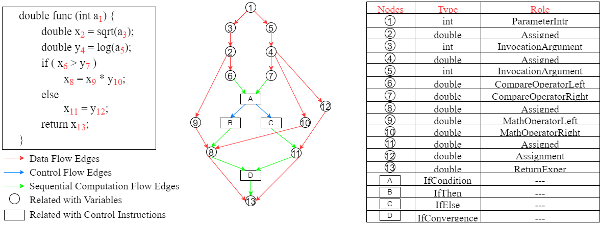

This repository provides the code and guidance for reproducing the results in our ESEC/FSE 2023 paper **"Pre-training Code Representations with Semantic Flow Graph for Effective Bug Localization"**(https://arxiv.org/pdf/2308.12773.pdf). Our paper aims to advance the state-of-the-art BERT-based bug localization techniques, which currently suffer from two issues: the pre-trained BERT models on source code are not robust enough to capture code semantics and the overall bug localization models neglect the necessity of large-scale negative samples in contrastive learning and ignore the lexical similarity between bug reports and changesets. To address these two issues, we 1) propose a novel directed, multiple-label Semantic Flow Graph (SFG), which compactly and adequately captures code semantics, 2) design and train SemanticCode-BERT on the basis of SFG, and 3) design a novel hierarchical momentum contrastive model for SemanticCodeBERT-based bug localization. Evaluation results confirm that our method achieves state-of-the-art performance in bug localization.

```
@inproceedings{fse-SFG,
  title={Pre-training Code Representation with Semantic Flow Graph for Effective Bug Localization},
  author={Du, Yali and Yu, Zhongxing},
  url = {https://arxiv.org/pdf/2308.12773.pdf},
  booktitle={Proceedings of the 31th ACM Joint Meeting on European Software Engineering Conference and Symposium on the Foundations of Software Engineering},
  year={2023},
  location = {San Fransisco, USA},
  series = {ESEC/FSE 2023}
}
```

## Instructions
**We fully implement an analyzer to get SFG for a Java method on top of Spoon** [1], and the analyzer supports modern Java versions up to Java 16. **The SemanticCodeBERT is trained using all the Java code in CodeSearchNet** [2], and we provide the pre-trained weights and the guidance to fine-tune the pre-trained model for downstream tasks. **The hierarchical momentum contrastive model for SemanticCodeBERT-based bug localization is evaluated using the dataset from Fbl-bert (including six software projects AspectJ, JDT, PDE, SWT, Tomcat, and ZXing) [3].** In particular, we selected the first half of the project’s pairs of bug reports and bug-inducing changesets, ordered by bug opening date, as the training dataset, and left the remaining half as the test dataset. **For a bug report as the anchor, we select a relevant changeset as a positive sample and an irrelevant changeset as a negative sample to form a triplet for feature-level and model-level contrastive learning.** As generating negative samples this way incurs a substantial computational cost, random sampling is used finally. **In bank-level contrastive learning, we use the memory bank to store rich representations of changesets. For a bug report, all changesets in the memory bank are regarded as negative samples.** Experiments have proved that increasing the size of negative samples can effectively improve retrieval accuracy. We provide related code, model weights, and data for the evaluation. 

The analyzer to get SFG for a method snippet is in the folder `SemanticFlowGraph`, which is implemented in Java. The main class (entry point) is `Activator`, which takes two path strings as the input. The first path string corresponds to the path where we store a set of input files for which we want to get their SFGs, and the second path string corresponds to the path where we store the analyzed SFG for each input file.  Each input file contains the code snippet for a certain method, and we assume each file is a txt type and each file is named with a certain integer. The folder `data_method_snippet` inside the folder `SemanticFlowGraph` gives examples of some input files.

The training of the model for bug localization is in folder `model`, which contains three parts: `Fine-tuning`, `Offline Indexing`, and `Retrieval`. The input to the fine-tuning model includes a bug report and corresponding changeset sequence, and the hierarchical and momentum contrast technical strategies are used to pull relevant changeset into the current bug report and push irrelevant changesets away. After fine-tuning the model on a project-specific dataset, we encode all changesets and store them in IVFPQ (InVert File with Product Quantization) index. The IVFPQ index is implemented using the Faiss library, which uses the k-means algorithm to partition the embedding space into programmed partitions and assign each embedding to its nearest cluster. In the retrieval process, the query bug report is first located to the nearest partition's centroid, and then the nearest instance within the partition is discovered. For each query bug report, we can identify the N's most similar changesets across all N changesets stored in the Faiss index. Therefore, we only re-rank the top-N' subset as the candidate changesets to produce the final ranking.

The evaluation is in the folder `results`. The main function is in `accuracy.py`, which computes MRR, MAP, P@1, P@3, and P@5 of the given test dataset. Evaluation results are saved to `retrieval_result.csv` in this folder. 


## Requirements
* Conda
  * install conda: [https://conda.io/projects/conda/en/latest/user-guide/install/index.html](https://conda.io/projects/conda/en/latest/user-guide/install/index.html)
  * Create a new conda environment:
      * if you are running with GPU: 
        ```
        conda env create -f environment-gpu.yml
        conda activate semanticcodebert
        ```
        Dependencies include support for CUDA_11.4. If you are using a different CUDA version update the dependencies accordingly.
      * if you are running with CPU:   
        ```
        conda env create -f environment-cpu.yml
        conda activate semanticcodebert
        ```
* Dataset
  * Download `dataset.zip` from [https://drive.google.com/file/d/1ReVzBC-1WSciPgKH0Shz6pPEkueTeA0I/view?usp=sharing](https://drive.google.com/file/d/1ReVzBC-1WSciPgKH0Shz6pPEkueTeA0I/view?usp=sharing)
  * Put `dataset.zip` in the main directory and unzip

* SemanticCodeBERT
  * Download `SemanticCodeBERT.zip` from [https://drive.google.com/drive/folders/1xsQothDM9Wfg7piPG5CwCKhlivq5QXfG?usp=sharing](https://drive.google.com/drive/folders/1xsQothDM9Wfg7piPG5CwCKhlivq5QXfG?usp=sharing)
  * Put `SemanticCodeBERT.zip` in the main directory and unzip
  
* BERTOverflow
  * Download `BERTOverflow.zip` from [https://drive.google.com/drive/folders/1xsQothDM9Wfg7piPG5CwCKhlivq5QXfG?usp=sharing](https://drive.google.com/drive/folders/1xsQothDM9Wfg7piPG5CwCKhlivq5QXfG?usp=sharing)
  * Put `BERTOverflow.zip` in the main directory and unzip


## Fine-tuning 
* Evaluate and fine-tune the pre-trained model with D-, ARC-, and ARCL-encoding on commits granularity.
```
sh run_commits_D.sh & dataset & cuda number
sh run_commits_ARC.sh & dataset & cuda number
sh run_commits_ARCL.sh & dataset & cuda number
```
* Evaluate and fine-tune the pre-trained model with D-, ARC- and ARCL-encoding on file granularity.
```
sh run_files_D.sh & dataset & cuda number
sh run_files_ARC.sh & dataset & cuda number
sh run_files_ARCL.sh & dataset & cuda number
```
* Evaluate and fine-tune the pre-trained model with D-, ARC-, and ARCL-encoding on hunks granularity.
```
sh run_hunks_D.sh & dataset & cuda number
sh run_hunks_ARC.sh & dataset & cuda number
sh run_hunks_ARCL.sh & dataset & cuda number
```
Evaluation results are saved to `retrieval_result.csv` in the `results` directory.

## Use the model on your dataset
* If you want to use the semantic flow graph for your dataset, you can provide the main class `Activator` in the `SemanticFlowGraph` directory with appropriate arguments to extract the semantic flow graph for your code.
* You can use the bug report and changeset sequences as the input of the bug localization model, and then modify the fine-tuning commands.

## References
[1] https://spoon.gforge.inria.fr/ <br>
[2] https://github.com/github/codesearchnet <br>
[3] Ciborowska A, Damevski K. Fast changeset-based bug localization with BERT[C]//Proceedings of the 44th International Conference on Software Engineering. 2022: 946-957.

## Acknowledgments and Licenses
* The main structure of our code is adapted from fbl-bert (https://dl.acm.org/doi/abs/10.1145/3510003.3510042). 
* All license clauses are in the LICENSE file.


